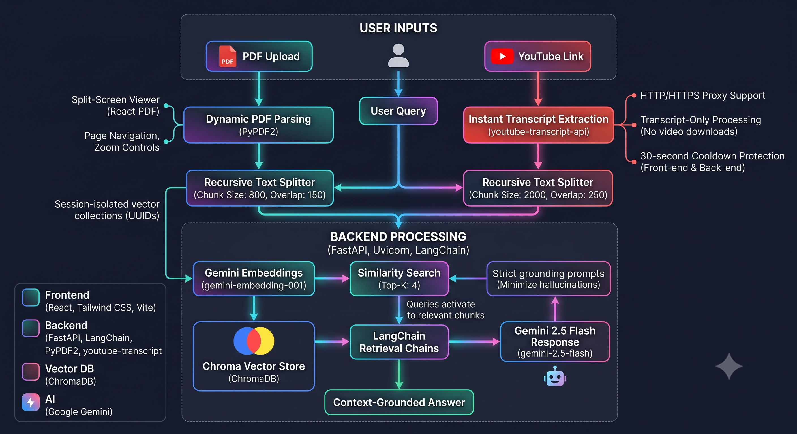

<div align="center">

# ⚡ OmniRAG

### A High-Performance Multimodal Retrieval-Augmented Generation (RAG) Platform

Chat directly with **PDF documents** and **YouTube video transcripts** using **Google Gemini**, **FastAPI**, **ChromaDB**, and **React**.

<p align="center">
  <a href="#-key-features">Features</a> •
  <a href="#-tech-stack">Tech Stack</a> •
  <a href="#-system-architecture">Architecture</a> •
  <a href="#-project-structure">Project Structure</a> •
  <a href="#-getting-started">Getting Started</a> •
  <a href="#-api-reference">API</a>
</p>

<p align="center">
  
  
  
  
</p>

</div>

---

## 📌 Overview

**OmniRAG** eliminates the friction of manually reading dense PDFs or scrubbing through lengthy YouTube videos.

Instead of searching page-by-page or timeline-by-timeline, users can upload a document or video and ask natural language questions. Behind the scenes, the content is transformed into semantic embeddings using **Google Gemini**, indexed inside **ChromaDB**, and retrieved through **LangChain's retrieval pipeline** before Gemini generates a context-grounded response.

The result is a fast, accurate, and scalable multimodal RAG platform that answers **only from the provided source material**, significantly reducing hallucinations.

---

## ✨ Key Features

### 📄 PDF RAG Workspace

- 📑 **Dynamic PDF Parsing** using `PyPDF2`
- 🔍 **Split-Screen PDF Viewer** powered by `react-pdf`
- 📖 Page navigation, zoom, and scaling controls
- 🔐 **Session-isolated vector collections** using UUIDs
- ⚡ Fast semantic retrieval with ChromaDB

---

### 🎥 YouTube Transcript RAG

- 🎬 Instant transcript extraction using `youtube-transcript-api`
- 🌐 Built-in HTTP/HTTPS proxy support
- ⏱️ 30-second frontend & backend cooldown protection
- 🚫 Prevents transcript service abuse and IP throttling

---

### 🧠 AI-Powered Retrieval

- 🤖 Google Gemini 2.5 Flash for generation
- 📊 Gemini Embedding 001 for semantic search
- 📚 LangChain Retrieval Chains
- 🎯 Strict grounding prompts to minimize hallucinations

---

## 🛠️ Tech Stack

<table>
<tr>
<td width="50%" valign="top">

### Frontend

- React (Vite)
- Tailwind CSS
- React Router DOM
- React PDF
- Lucide React

</td>
<td width="50%" valign="top">

### Backend

- FastAPI
- Uvicorn
- LangChain
- ChromaDB
- Google Gemini
- PyPDF2
- youtube-transcript-api

</td>
</tr>
</table>

---

## 🏗️ System Architecture

<p align="center">
  
</p>

---

## 📂 Project Structure

```text
OmniRAG/
├── backend/
│   ├── main.py              # FastAPI routes & LangChain pipelines
│   ├── requirements.txt
│   └── .env
│
└── frontend/
    ├── src/
    │   ├── Landing.jsx
    │   ├── PDFChat.jsx
    │   └── YouTubeChat.jsx
    ├── package.json
    └── .env
```

---

## 🚀 Getting Started

### 📋 Prerequisites

| Requirement | Version |
|------------|---------|
| Node.js | 18+ |
| Python | 3.10+ |
| Google Gemini API Key | Required |

---

# Backend Setup

Navigate into the backend directory.

```bash
cd backend
```

### Create Virtual Environment

**Windows**

```bash
python -m venv venv
venv\Scripts\activate
```

**Mac/Linux**

```bash
python -m venv venv
source venv/bin/activate
```

### Install Dependencies

```bash
pip install fastapi uvicorn pydantic python-dotenv PyPDF2 \
langchain-google-genai langchain-community chromadb \
youtube-transcript-api langchain-classic
```

### Configure Environment

Create `.env`

```env
GOOGLE_API_KEY=your_gemini_api_key_here
```

### Run Backend

```bash
uvicorn main:app --reload --port 8000
```

Backend runs on:

```
http://localhost:8000
```

---

# Frontend Setup

Open another terminal.

```bash
cd frontend
```

### Install Dependencies

```bash
npm install
```

### Configure Environment

Create `.env`

```env
VITE_API_URL=http://localhost:8000
```

### Run Frontend

```bash
npm run dev
```

Frontend runs on:

```
http://localhost:5173
```

---

## 🔌 API Reference

### 📄 Upload PDF

| Method | Endpoint |
|--------|----------|
| POST | `/upload` |

**Request**

`multipart/form-data`

```
file: sample.pdf
```

**Response**

```json
{
  "document_id": "8f3a1b2c-...",
  "filename": "sample.pdf"
}
```

---

### 💬 Chat with PDF

| Method | Endpoint |
|--------|----------|
| POST | `/chat` |

**Request**

```json
{
  "document_id": "8f3a1b2c-...",
  "message": "What is discussed in Section 3?"
}
```

**Response**

```json
{
  "answer": "According to Section 3..."
}
```

---

### 🎥 Process YouTube Video

| Method | Endpoint |
|--------|----------|
| POST | `/uploadLink` |

**Request**

```json
{
  "video_id": "dQw4w9WgXcQ"
}
```

**Response**

```json
{
  "message": "Video uploaded successfully.",
  "video_id": "dQw4w9WgXcQ",
  "chunks_added": 12
}
```

---

### ❓ Ask About Video

| Method | Endpoint |
|--------|----------|
| POST | `/ask` |

**Request**

```json
{
  "query": "Summarize the key points."
}
```

**Response**

```json
{
  "answer": "The video primarily discusses..."
}
```

---

## ⚡ How OmniRAG Works

<table>
<tr>
<td align="center">📤</td>
<td><strong>Upload</strong><br/>PDF or YouTube link is submitted.</td>
</tr>
<tr>
<td align="center">✂️</td>
<td><strong>Chunk</strong><br/>Content is split into overlapping chunks.</td>
</tr>
<tr>
<td align="center">🧠</td>
<td><strong>Embed</strong><br/>Gemini converts chunks into embeddings.</td>
</tr>
<tr>
<td align="center">🗄️</td>
<td><strong>Store</strong><br/>Embeddings are stored inside ChromaDB.</td>
</tr>
<tr>
<td align="center">🔍</td>
<td><strong>Retrieve</strong><br/>Top relevant chunks are fetched.</td>
</tr>
<tr>
<td align="center">✨</td>
<td><strong>Generate</strong><br/>Gemini answers using retrieved context.</td>
</tr>
</table>

---

## 📊 Performance Configuration

| Feature | Value |
|---------|-------|
| PDF Chunk Size | 800 |
| PDF Overlap | 150 |
| YouTube Chunk Size | 2000 |
| YouTube Overlap | 250 |
| Retrieval Top-K | 4 |
| Embedding Model | `gemini-embedding-001` |
| Generation Model | `gemini-2.5-flash` |

---

## 🔒 Security & Reliability

<table>
<tr>
<td width="50%" valign="top">

### 🛡️ Strict Context Grounding

Gemini is instructed to answer only from retrieved content and explicitly state when information is unavailable.

</td>
<td width="50%" valign="top">

### ⏱️ Upload Cooldown

30-second client cooldown on transcript ingestion prevents rate-limit bans.

</td>
</tr>
<tr>
<td width="50%" valign="top">

### 🔐 Session Isolation

Each uploaded PDF receives its own UUID-based Chroma collection.

</td>
<td width="50%" valign="top">

### 🎬 Transcript-Only Processing

No video downloads are performed—only captions are processed.

</td>
</tr>
</table>

---

## 🚀 Future Improvements

- [ ] Page-level citations
- [ ] Streaming responses
- [ ] Multi-document conversations
- [ ] OCR support for scanned PDFs
- [ ] User authentication
- [ ] Chat history
- [ ] Docker Compose deployment
- [ ] Dark mode toggle

---

## 📜 License

This project is licensed under the **MIT License**.

---

<div align="center">

### ⭐ If you found OmniRAG useful, consider giving it a Star!

Built with ❤️ using **FastAPI**, **React**, **LangChain**, **ChromaDB**, and **Google Gemini**.

</div>
